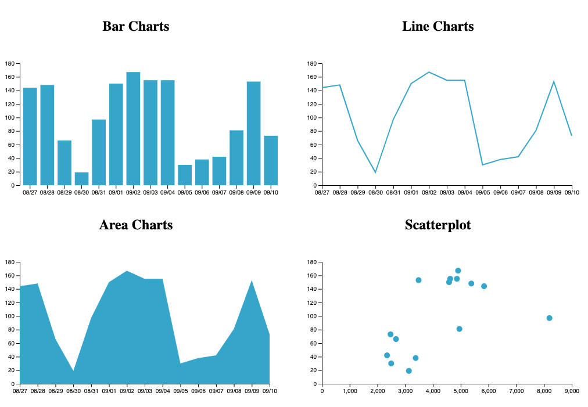

Interactive charts with JavaScript and D3 to explore Covid-19 data.

## Drawing the Visaulizations with D3

The bar chart, line chart, and area chart uses the date for x-axis, and the selected metric of the Data Metric drop-down for the values rendered on the y-axis. 

The scatterplot uses the cases for x-axis, and the deaths for y-axis.

Final Result - 

## Demo

Here is a demo of how the interactions could look like. You can also check out a higher resolution version [here](figures/hw3_demo.mov).

