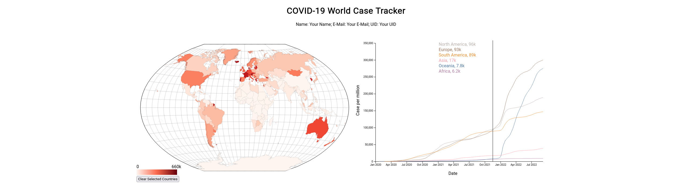
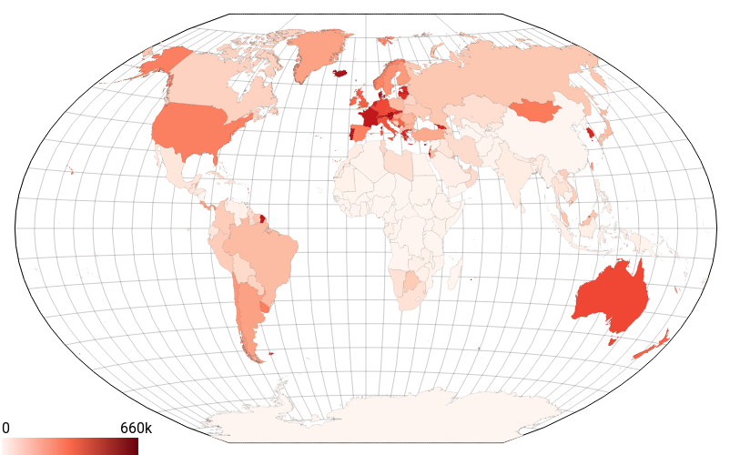
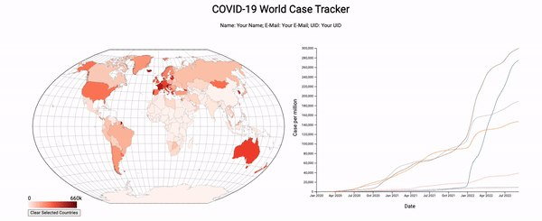

Built a visualization inspired by [OurWorldInData's](https://ourworldindata.org/covid-cases) COVID-19 dashboard. The visualization we will make is made up of two views: a map and a line chart.

The **map** provides geospatial context. Countries are color-coded with maximum cases per million residents and can be selected to update the line chart with a detailed view of that country.

The **line chart** has a couple of different states. The first is when there is no selected country. In this state, the chart shows the total cases for each continent over time. The second state is when we select a country (or countries) in the map view. When we do this, the visualization should change to show the case trends of just the selected countries.

When a country is selected in the map, the country is highlighted on the map and the line chart will show that country for detailed inspection. The final visualization-



## The Data

The map uses GeoJSON data that is contained in the `world.json` file. The file `owid-covid.csv` contains COVID-19 data from the start of the pandemic until September 7th, 2022.

Here is a sample of the COVID-19 data-

```
iso_code,location,date,total_cases_per_million
AFG,Afghanistan,2020-02-24,0.125
AFG,Afghanistan,2020-02-25,0.125
AFG,Afghanistan,2020-02-26,0.125
AFG,Afghanistan,2020-02-27,0.125
...
EGY,Egypt,2022-09-05,4719.337
EGY,Egypt,2022-09-06,4719.337
EGY,Egypt,2022-09-07,4719.337
SLV,El Salvador,2020-03-19,0.158
SLV,El Salvador,2020-03-20,0.158
...
```

## Map View



The interaction allows you to select multiple countries for them to show up in the line chart. Clicking an unselected country selects it, and clicking on a selected country deselects it. 

## Line Chart


The line chart have an interaction where on hover, there will be a line displayed at the current mouse position, and a display of the `location` and `total_cases_per_million` at the date of the hovered position for each location that is plotted. 

Here is the final visualization, and a higher resolution [video](figs/video.mov)


