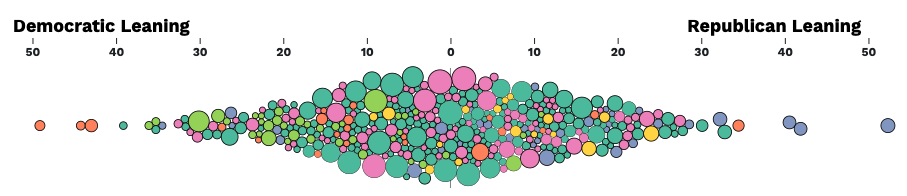
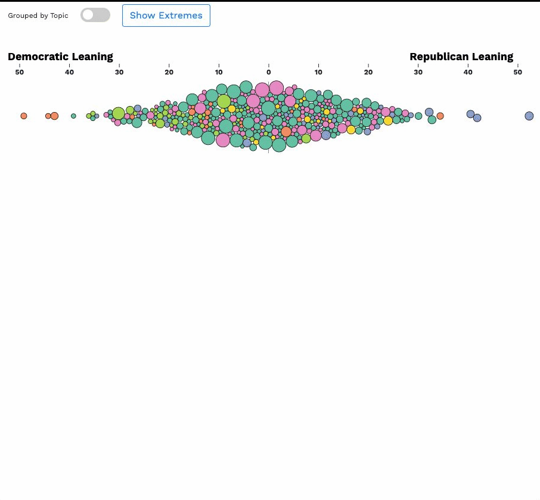
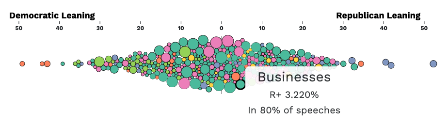
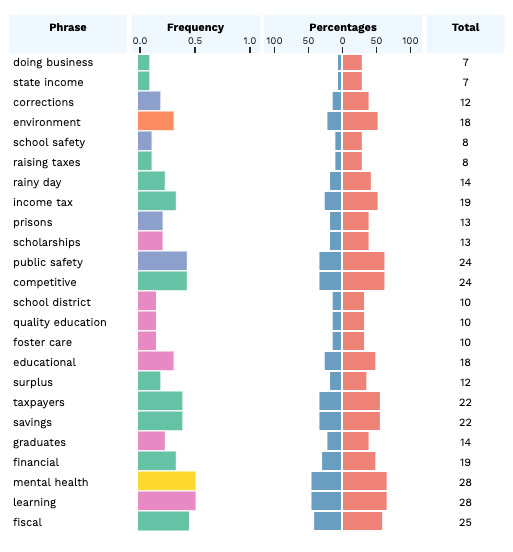

Built an interactive visualization to explore the political polarity of words used in US governors' state of the state addresses. The visualization is inspired by the NY Times visualization of [corporate tax rates](https://archive.nytimes.com/www.nytimes.com/interactive/2013/05/25/sunday-review/corporate-taxes.html).

Data is from [538's public data repositories](https://github.com/fivethirtyeight/data/blob/master/state-of-the-state/words.csv).

## Visualization Design

[Here](assets/demo.mov) is a demo of the functionality..

## The Data
The data set is a collection of N-grams that are taken from US governors' state of the state addresses. The team at 538 conducted a textual analysis of the resulting N-grams to see what issues were talked about the most and whether there were differences between what Democratic and Republican governors were focusing on. We will be plotting the N-grams along a diverging x-axis to see the differences between words used in Democratic and Republican speeches.

## Bubblechart
The bubble chart (beeswarm chart) shows all of the N-grams along a divergent x-axis by percent difference. N-grams used more by democrats appear left of the chart, while those used more by republicans appear on the right. The x and y position for the circles is determined by the `sourceX` and `sourceY` property in the data. The size of the circle encodes the total count which is the `total` property in the data. Circle color encodes the category of the N-gram.

### Toggle between overall and grouped layout
We used a toggle to separate the beeswarm plot into the N-gram categories. When you click the button or toggle, the groups should be separated in y direction. When you click the toggle again, all circles should return to the one plot. 

### Tooltip for circle hover
A tooltip that shows the N-gram, the political difference (`position` in the data), and the total frequency of the N-grams use (needs to be calculated using the `total` divided by 50).

## Table
The second major view is the table. This uses the same data set, however, you should create these headers `Phrase, Frequency, Percentages, and Total`. These will be the columns for your table. The phrase is the N-gram (`phrase` in the data). The frequency is the same as that which you have calculated for the tooltip. The percentages column will encode both the republican and democratic percentages for the N-gram. The Total is the `total` property.

### Clicking on the headers sorts the data table ascending / descending
When you click on the headers, the table is sorted by that column. Clicking again inverts the sorting.

## Brushes

