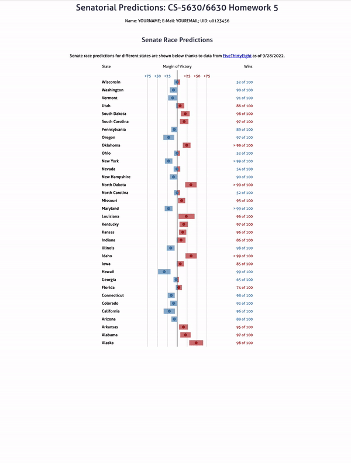

Visualized polling data and predictions for the upcoming US senate election. The goal is to visualize the predicted margin of victory for the candidates in each state, but to also show the uncertainty in the race as of late September. Finally, we also want to show the “raw” data underlying these predictions – the polling data.

We've retrieved the data from [FiveThirtyEight's website](https://fivethirtyeight.com/)

Final visualization: 

## The table
Implemented the bars showing the confidence interval. The dot represents the `margin` attribute. The dots are colored based on who is predicted to win, similar to the bar charts. Clicking header of any column, sorts the table using that column in ascending order. Again clicking the same column inverts the order.

The user is able to select a state and see all of the polls for that state displayed under it in the table. Please note, there are some states without any polling. Those are: Oregon, North Dakota, Idaho, Hawaii, California, and Alabama.

In the following example you can see both Utah and Washington expanded.

## DEMO 

