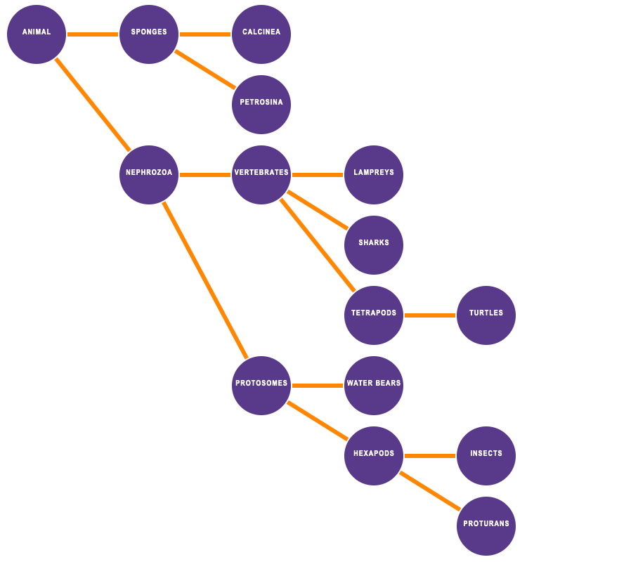

We used JavaScript to create a tree data structure, and render that tree to the browser with the D3 library.

## Data

The source data from which to construct the tree lives in the `data/Tree.json` file (see snippet below). This JSON file contains a list of objects, where each object has a name, and references the name of its parent.

```JSON
[{
   "name":"Animal",
    "parent":"root"
  },
  {
    "name":"Sponges",
    "parent":"Animal"
  },
  {
    "name":"Nephrozoa",
    "parent":"Animal"
  },...
```

The final tree-:


